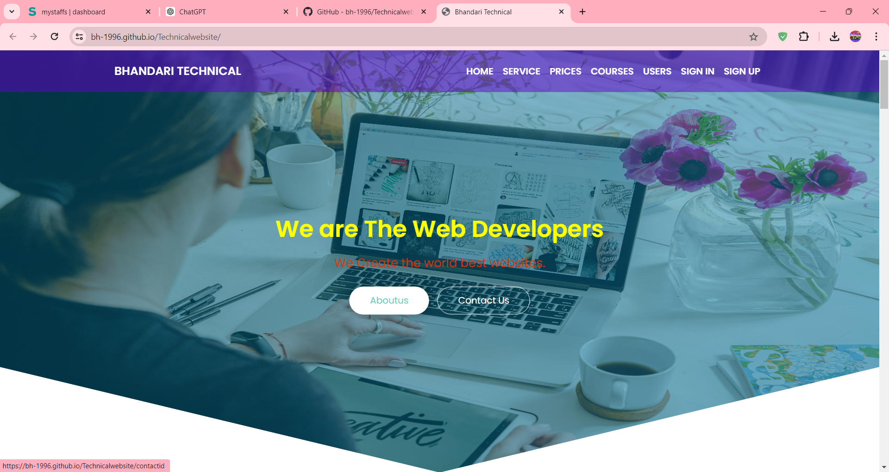
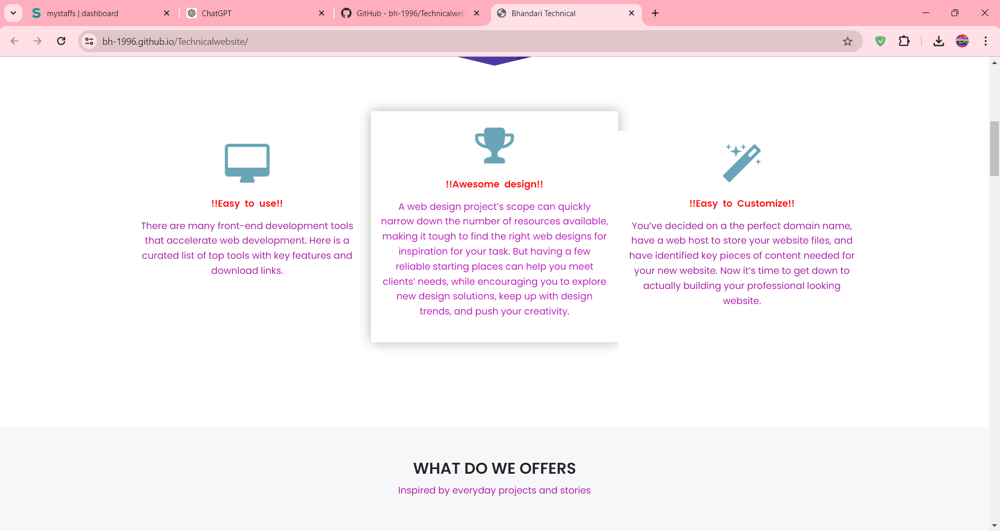

### Auther : MBK Bhandari ( https://www.linkedin.com/in/mbk-9852/ )

# BhandariTechnical

**BhandariTechnical** is a Laravel-based website created to provide students with valuable information and resources related to various technical subjects. This platform aims to support students in their academic journey by offering educational content, announcements, and updates.

## Features

- **Educational Content:** Access a wide range of articles, tutorials, and resources across different technical fields.
- **Announcements and Updates:** Stay informed with the latest news, events, and announcements relevant to students.
- **User-Friendly Interface:** Designed with students in mind, the website is easy to navigate and use.
- **Built with Laravel:** Utilizing the powerful Laravel framework for a secure, scalable, and maintainable application.

## Installation

To get a local copy up and running, follow these simple steps:

1. **Clone the repository:**

   ```bash
   git clone git@github.com:bh-1996/Bhandari-Technical.git

2. Navigate to the project directory:
    ```bash
    cd Bhandari-Technical

3. Install dependencies:
    ```bash
    composer install

4. Copy .env.example to .env and configure your environment variables:
    ```bash
    cp .env.example .env

5. Generate application key:
    ```bash
    php artisan key:generate

6. Run database migrations:
    ```bash
   php artisan migrate

7. Serve the application:
    ```bash
    php artisan passport:install

8. Serve the application:
    ```bash
    php artisan serve

**Show some image of project**



